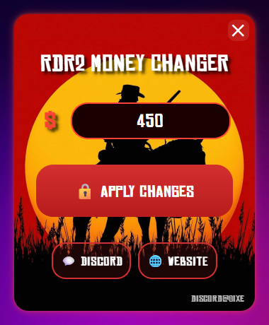

# 🎮 RDR2 Money Changer

 

A simple tool to modify your money amount in Red Dead Redemption 2 (RDR2).

## ✨ Features

- **Easy to Use**: Simple interface to change your in-game money
- **Real-time Updates**: Changes take effect immediately in-game
- **Safe**: Only modifies money value, no other game files are touched
- **Clean UI**: Modern, glowing red interface matching RDR2's theme

## 📥 Installation

1. Download the latest release from the [Releases](https://github.com/VENESK/rdr2-money-editor/releases) page
2. Extract the ZIP file
3. Run `RDR2 Money Changer.exe`

## 🎯 How to Use

1. Launch Red Dead Redemption 2
2. Run RDR2 Money Changer
3. Enter desired money amount
4. Click "Apply Changes"

## 🔧 Technical Details

This tool uses memory manipulation to change the money value in-game. The pointer offsets and memory locations were carefully researched to work with the latest game version.

> **Note**: The detailed code comments in the source files were generated with AI assistance to provide better documentation.

## 🌐 Links

- [Website](https://0ixe.site)
- [Discord Community](https://discord.gg/dYu4Gnm7Ke)

## ⚠️ Disclaimer

This tool is for educational purposes only. Use at your own risk. We are not responsible for any consequences of using this tool.

## 📝 License

MIT License - feel free to modify and distribute as you wish!
